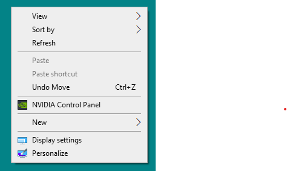

# Remove Windows 10 Context Menus

I used Google Drive at one point in time. It would slow down the Windows context menu
every time I right-clicked in the Windows Explorer. Awful stuff.

Here are a few .reg scripts to remove Context Menus

## Usage

Download or clone this repository and double-click the reg file you want to
use. You'll see a [UAC](https://en.wikipedia.org/wiki/User_Account_Control) prompt, type "Alt-Y" or click "Yes"
if you want to take it all away.

Reg files

* Dropbox
* Git for Windows
* Visual Studio 2019

## Example

After

## LICENSE

MIT. Please don't break your computer.
